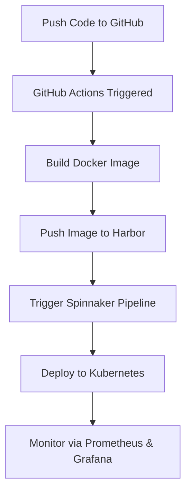

<<<<<<< HEAD
# 🚀 CI/CD Deployment with Kubernetes, Spinnaker & GitHub Actions

This project showcases a robust CI/CD pipeline architecture that automates the end-to-end software delivery lifecycle. Leveraging **Kubernetes** for orchestration, **Spinnaker** for advanced deployment strategies, and **GitHub Actions** for continuous integration, the system ensures scalable, reliable, and efficient application delivery.

---

## 📚 Table of Contents

- [Overview](#overview)
- [Key Features](#key-features)
- [Tech Stack](#tech-stack)
- [System Architecture](#system-architecture)
- [CI/CD Workflow](#cicd-workflow)
- [Setup Guide](#setup-guide)
- [Project Structure](#project-structure)
- [Contributors](#contributors)
- [License](#license)

---

## 🌐 Overview

The **CI/CD Deployment** project is designed to streamline and automate the software development lifecycle. It integrates Continuous Integration (CI) and Continuous Deployment (CD) best practices to reduce manual effort, minimize errors, and deliver production-ready applications efficiently.

---

## ✨ Key Features

- 🔄 **Fully Automated CI/CD Pipeline**  
  Automatically build, test, and deploy applications across environments.

- 🧱 **Kubernetes Native Deployments**  
  Scalable and resilient containerized application deployment.

- 🚀 **Spinnaker for Continuous Delivery**  
  Enables sophisticated deployment strategies like canary and blue-green deployments, with rollback support.

- ⚙️ **GitHub Actions for CI**  
  Multi-stage CI pipelines integrated with GitHub for seamless code management.

- 🐳 **Harbor Image Registry**  
  Secure Docker image storage with vulnerability scanning.

- 📊 **Real-time Monitoring**  
  Integrated **Prometheus** and **Grafana** dashboards for performance metrics and alerting.

- ☁️ **MinIO as S3 Storage**  
  S3-compatible object storage for storing deployment artifacts and Spinnaker metadata.

---

## 🔧 Tech Stack

| Component     | Description                        |
|---------------|------------------------------------|
| Kubernetes    | Container orchestration            |
| Spinnaker     | Continuous delivery management     |
| GitHub Actions| Continuous integration pipelines   |
| Harbor        | Docker image registry              |
| Prometheus    | Monitoring and alerting            |
| Grafana       | Visualization and dashboards       |
| MinIO         | S3-compatible object storage       |

---

## 🛠️ Setup Guide

### 1. Clone the Repository
=======
# Task Management Application along with CICD Deployment

This repository contains a Flask-based **Task Management Application** with a CI/CD pipeline for building, testing, and deploying Docker images.

The application includes user authentication, task management features, and Prometheus metrics for monitoring.

---

## Features

- **Task Management**: Add, view, and manage tasks with priority and completion status.
- **User Authentication**: Secure login and signup functionality.
- **Prometheus Metrics**: Exposes `/metrics` endpoint for monitoring.
- **MongoDB Integration**: Stores user and task data in MongoDB.
- **CI/CD Pipeline**: Automated Docker image build, vulnerability scanning, and deployment using GitHub Actions.
- **Google Cloud Pub/Sub**: Publishes deployment notifications.

---

## Prerequisites

- **Python 3.9+**
- **Docker**
- **MongoDB**
- **Harbor Registry**
- **Google Cloud Pub/Sub**

---

## Installation

1. Clone the repository:
>>>>>>> 36495771aeff6eed271495099b2d5cbc856badbe

```bash
git clone https://github.com/yagnesh0312/cicd-deployment.git
cd cicd-deployment
```

<<<<<<< HEAD
### 2. Follow Setup Instructions

Detailed setup instructions for each component (Kubernetes cluster, Spinnaker, Harbor, Prometheus, Grafana, etc.) are provided in the respective subdirectories and documentation files within the repo.

---

## 🔁 CI/CD Workflow



---

## 📁 Project Structure

```
cicd-deployment/
├── .github/                     # GitHub Actions workflows
│   └── workflows/              # CI pipeline definitions
├── .pytest_cache/              # Cache directory for pytest runs
│   └── v/
│       └── cache/
├── kubernetes/                 # Kubernetes configurations
│   ├── CD/                     # Spinnaker or deployment-related manifests
│   └── grafana/                # Grafana dashboards and config
├── static/                     # Static assets used in documentation or UI
│   ├── assets/                 # Miscellaneous static resources
│   └── images/                 # Diagrams, screenshots, logos, etc.
└── README.md                   # Project documentation
```

---

## 🤝 Contributors

- [Harsh Panchal](https://github.com/HarshPanchal18)  
- [Yagnesh Jariwala](https://github.com/yagnesh0312)

---

## 📄 License

This project is licensed under the [MIT License](LICENSE).

=======
2. Install dependencies

```bash
pip install -r requirements.txt
```

3. Set up environment variables: Create a `.env` file in the root directory with the following:

```text
MONGO_CONN_STRING=<your-mongo-connection-string>
MONGO_DB_NAME=<your-database-name>
MONGO_COLLECTION_NAME=<your-collection-name>
SECRET_KEY=<your-secret-key>
PORT=3000
```

4. Run the application

```bash
python app.py
```

5. Access the application at `http://localhost:3000`

## Docker Usage

- Build the Docker Image

```bash
docker build -t task-management-app .
```

- Run the Docker Container

```bash
docker run -p 3000:3000 --env-file .env task-management-app
```

## CI/CD Pipeline

The CI/CD pipeline is defined in .github/workflows/Build-Deployment-Harsh.yml and includes the following steps:

**`Build Docker Image`**: Builds the application image.
**`Run Tests`**: Executes tests inside a Docker container.
**`Trivy Scan`**: Scans the Docker image for vulnerabilities.
**`Push to Harbor`**: Pushes the image to the Harbor registry.
**`Google Cloud Pub/Sub`**: Publishes a deployment notification.

## Prometheus Metrics

The application exposes Prometheus metrics at the /metrics endpoint. These metrics include:

- HTTP request counts
- Request latencies
- Custom application metrics

## Project Structure

```text
.
├── app.py                 # Main application code
├── Dockerfile             # Docker configuration
├── requirements.txt       # Python dependencies
├── .github/workflows/     # CI/CD pipeline configuration
├── templates/             # HTML templates for Flask
├── static/                # Static files (CSS, JS, images)
└── README.md              # Project documentation
```

## Contributing

Contributions are welcome! Please follow these steps:

1. Fork the repository.
2. Create a new branch: git checkout -b feature-name.
3. Commit your changes: git commit -m "Add feature-name".
4. Push to the branch: git push origin feature-name.
5. Open a pull request.

## Contact

```text
Feel free to customize the content further based on your specific project details!
```
>>>>>>> 36495771aeff6eed271495099b2d5cbc856badbe
