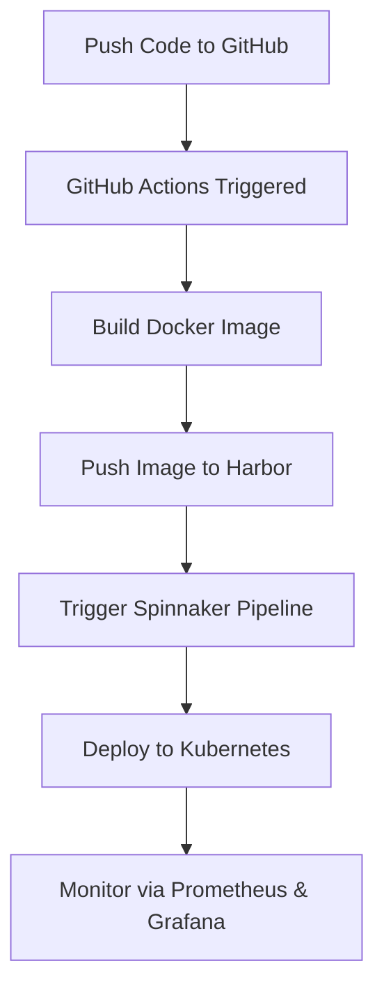

# 🚀 CI/CD Deployment with Kubernetes, Spinnaker & GitHub Actions

This project showcases a robust CI/CD pipeline architecture that automates the end-to-end software delivery lifecycle. Leveraging **Kubernetes** for orchestration, **Spinnaker** for advanced deployment strategies, and **GitHub Actions** for continuous integration, the system ensures scalable, reliable, and efficient application delivery.

---

## 📚 Table of Contents

- [Overview](#overview)
- [Key Features](#key-features)
- [Tech Stack](#tech-stack)
- [System Architecture](#system-architecture)
- [CI/CD Workflow](#cicd-workflow)
- [Setup Guide](#setup-guide)
- [Project Structure](#project-structure)
- [Contributors](#contributors)
- [License](#license)

---

## 🌐 Overview

The **CI/CD Deployment** project is designed to streamline and automate the software development lifecycle. It integrates Continuous Integration (CI) and Continuous Deployment (CD) best practices to reduce manual effort, minimize errors, and deliver production-ready applications efficiently.

---

## ✨ Key Features

- 🔄 **Fully Automated CI/CD Pipeline**  
  Automatically build, test, and deploy applications across environments.

- 🧱 **Kubernetes Native Deployments**  
  Scalable and resilient containerized application deployment.

- 🚀 **Spinnaker for Continuous Delivery**  
  Enables sophisticated deployment strategies like canary and blue-green deployments, with rollback support.

- ⚙️ **GitHub Actions for CI**  
  Multi-stage CI pipelines integrated with GitHub for seamless code management.

- 🐳 **Harbor Image Registry**  
  Secure Docker image storage with vulnerability scanning.

- 📊 **Real-time Monitoring**  
  Integrated **Prometheus** and **Grafana** dashboards for performance metrics and alerting.

- ☁️ **MinIO as S3 Storage**  
  S3-compatible object storage for storing deployment artifacts and Spinnaker metadata.

---

## 🔧 Tech Stack

| Component     | Description                        |
|---------------|------------------------------------|
| Kubernetes    | Container orchestration            |
| Spinnaker     | Continuous delivery management     |
| GitHub Actions| Continuous integration pipelines   |
| Harbor        | Docker image registry              |
| Prometheus    | Monitoring and alerting            |
| Grafana       | Visualization and dashboards       |
| MinIO         | S3-compatible object storage       |

---

## 🛠️ Setup Guide

### 1. Clone the Repository

```bash
git clone https://github.com/yagnesh0312/cicd-deployment.git
cd cicd-deployment
```

### 2. Follow Setup Instructions

Detailed setup instructions for each component (Kubernetes cluster, Spinnaker, Harbor, Prometheus, Grafana, etc.) are provided in the respective subdirectories and documentation files within the repo.

---

## 🔁 CI/CD Workflow



---

## 📁 Project Structure

```
cicd-deployment/
├── .github/                     # GitHub Actions workflows
│   └── workflows/              # CI pipeline definitions
├── .pytest_cache/              # Cache directory for pytest runs
│   └── v/
│       └── cache/
├── kubernetes/                 # Kubernetes configurations
│   ├── CD/                     # Spinnaker or deployment-related manifests
│   └── grafana/                # Grafana dashboards and config
├── static/                     # Static assets used in documentation or UI
│   ├── assets/                 # Miscellaneous static resources
│   └── images/                 # Diagrams, screenshots, logos, etc.
└── README.md                   # Project documentation
```

---

## 🤝 Contributors

- [Harsh Panchal](https://github.com/HarshPanchal18)  
- [Yagnesh Jariwala](https://github.com/yagnesh0312)

---

## 📄 License

This project is licensed under the [MIT License](LICENSE).

